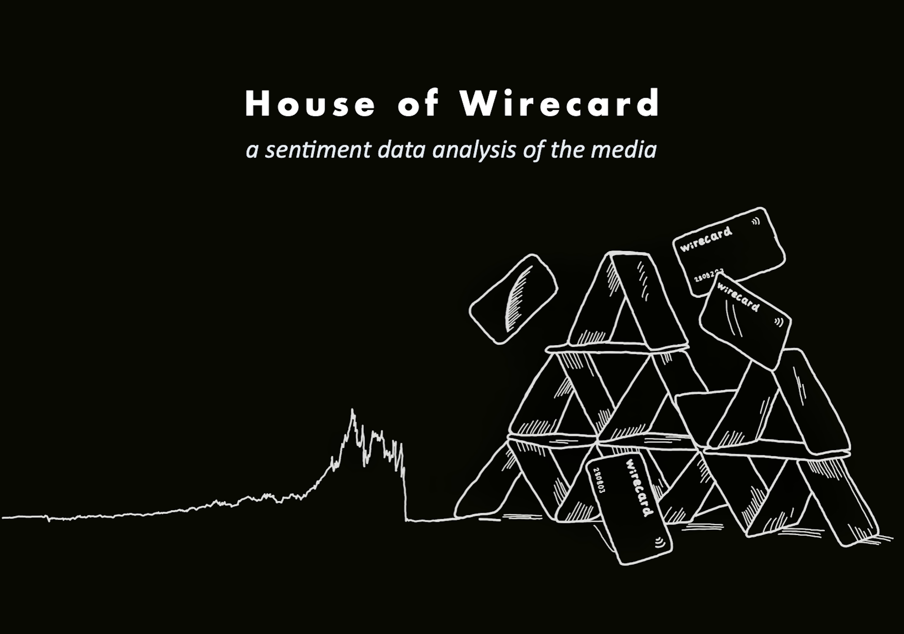

# House of Wirecard 📉

For years, the german payment service provider Wirecard was seen as a beacon of hope and a flagship company in the German technology sector. Politicians, the media and investors saw Wirecard as an innovative German fintech company that could compete with the big tech companies from Silicon Valley and placed a lot of trust and money in the management. The share price rose rapidly within a few years. However, the advertised flagship company turned out to be a billion-dollar accounting scandal full of lies and criminal energy. On June 25, 2020, Wirecard filed for insolvency and the company went bankrupt. 

While the role of supervisory authorities, politicians and auditors has been the subject of controversial debate ever since, the influence of media coverage has been little investigated to date. On the one hand, newspapers, television and the Internet served as Wirecard's mouthpiece and reinforced the hype surrounding the company for a long time with positive headlines. On the other hand, the multi-billion dollar accounting scandal was only uncovered in the first place thanks to critical and investigative reporting.

As part of my written work (Besondere Lernleistung) during my Abitur, I dealt intensively with the Wirecard case. I analyzed and evaluated the reporting of three popular German media on Wirecard. In my opinion, the German media landscape did not report critically enough despite warning signals, for example from the Financial Times.

With this sentiment analysis, I would like to examine the reporting of Spiegel, Handelsblatt and ManagerMagazin and see whether my thesis is confirmed.